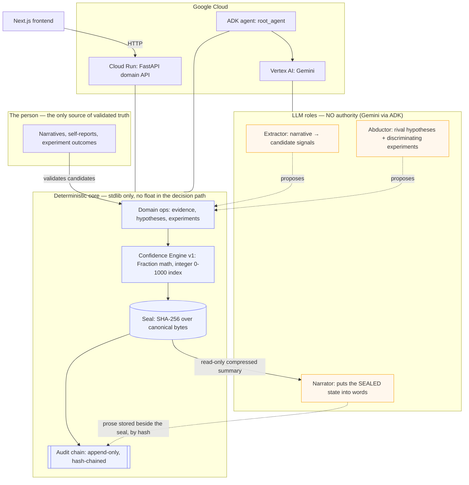

# COMPASS

**An adaptive personal-navigation partner. A compass, not a mirror.**

COMPASS helps a person discover their own capabilities and direction from
evidence of their own life, through cycles of hypothesis → experiment →
update. Two invariants separate it from a personality test with a chatbot
bolted on:

1. **No claim about the person exists without recorded, sealed evidence.**
2. **No number describing the person ever comes out of an LLM.** A
   deterministic engine computes and *seals* every index before any model
   is called.

The full design rationale is in [`docs/COMPASS-DESIGN-v0.md`](docs/COMPASS-DESIGN-v0.md).

---

## Hackathon — All Things Agentic

**Category: Collaborative Partner** — an interactive agent that walks the
person through the abductive cycle and learns from the sealed state between
turns.

The three mandatory boxes, all checked:

| Requirement | How COMPASS meets it |
|---|---|
| **Gemini model** (Gemini API or Vertex AI) | `GeminiBackend` (`src/compass/llm.py`) — one backend for both transports via the native `google-genai` env flags. The mandatory model, used only to *narrate* and *propose*. |
| **Google agent framework** | **ADK** — `compass.agent.root_agent` (`src/compass/agent/agent.py`): a Collaborative Partner whose authority is exactly its tool set. |
| **Google Cloud service** | **Cloud Run** hosts the FastAPI backend; **Vertex AI** serves Gemini through the service identity (no API key stored). See [`DEPLOY.md`](DEPLOY.md). |

- **Live backend (Cloud Run + Gemini/Vertex):** https://compass-1028999311218.us-central1.run.app
  ([`/health`](https://compass-1028999311218.us-central1.run.app/health) ·
  [`/api/state`](https://compass-1028999311218.us-central1.run.app/api/state) ·
  [`/docs`](https://compass-1028999311218.us-central1.run.app/docs))
- **Live web app (Cloud Run):** https://compass-web-1028999311218.us-central1.run.app
- **Demo video:** _to be filled_
- **Architecture diagram:** below, and in [`docs/ARCHITECTURE.md`](docs/ARCHITECTURE.md).

> Proven in production: `POST /api/narrate` with Gemini 2.5 Flash on Vertex
> returns the same state seal (`8fc1128…`) as the offline backend — the model
> changed the words, not a single sealed number. That is the whole thesis.

### Anyone can use it — judges and owner alike

The hosted service is multi-user with no login. Every browser gets its own
**isolated compass**, keyed by an opaque `X-Compass-User` id (a per-browser
session key, or one you pin to return to yours). Each id maps to its own
sealed SQLite base, seeded with a starter scenario so you land on something
you can immediately explore and modify without touching anyone else's. Each
base is snapshotted to Cloud Storage after every write and restored on
access, so your compass survives cold starts and redeploys. The id is
validated against a strict allowlist (`^[A-Za-z0-9_-]{1,64}$`) before it ever
touches a path. If storage is unreachable the service degrades to local-only
and says so on `/health` — a persistence failure never destroys a computed
result.

### Why this is an *architecturally disciplined* agent

The differentiator is not that an agent talks; it is **where the agent is
not allowed to be**. A language model can read the evidence correctly and
still reach the wrong conclusion under narrative pressure. So the model
never touches the decision path:

- The deterministic engine produces and **seals** every index *before* the
  agent or narrator is invoked. The model cannot influence a value that was
  already fixed.
- The ADK agent's authority is bounded by its tools. Only one tool
  (`recompute_indices`) produces numbers, and it runs the deterministic
  engine and seals the result *before returning it*: the agent reads the
  number, it does not fabricate one. There is deliberately **no tool** to
  validate evidence, discard a hypothesis, or declare an experiment's
  outcome — those are the person's acts.
- **Architecture test:** swapping the model backend (Gemini ↔ the offline
  `demo`/`fake` backend) changes only the wording — never a verdict, seal,
  or the chain of custody. This is enforced by
  `tests/test_hackathon_layer.py::test_swapping_narrator_backend_never_changes_the_seal`.

---

## Architecture



**Authority — who may assert what:**

| Component | Authority | May |
|---|---|---|
| Evidence ledger | the person + the facts | record validated evidence, never delete it silently |
| Confidence engine | versioned rules | compute indices, seal them |
| LLM (Gemini) | none | propose, abduce, narrate — never decide or score |

---

## Quickstart

The core is **pure Python stdlib**. It runs the entire cycle offline, with
no credential and no cloud, using a role-aware `demo` backend.

### 1. The core cycle (CLI, offline)

```bash
python3 -m pytest                          # 100 tests
PYTHONPATH=src python3 -m compass init     # then: person, hyp, evidence, link,
                                           # exp, recompute, compass, verify ...
python3 tools/verify_chain.py compass.db   # independent, stdlib-only verifier
```

`tools/verify_chain.py` re-implements the seal spec on purpose, so
confirming the audit chain does not require trusting the code that wrote it.

### 2. The API + web app (local)

```bash
pip install '.[api]'                        # fastapi + uvicorn
COMPASS_BACKEND=demo COMPASS_DB=/tmp/compass.db \
  uvicorn compass.api:app --reload --port 8080
# → http://localhost:8080/health  and  /docs
```

The API seeds a demo scenario on first boot, so the compass is populated
immediately. Then, in `frontend/`:

```bash
cd frontend && npm install
NEXT_PUBLIC_API_URL=http://localhost:8080 npm run dev   # → http://localhost:3000
```

### 3. With the real Gemini model

```bash
pip install '.[gemini,adk]'
# Gemini API key:
export COMPASS_BACKEND=gemini GEMINI_API_KEY=...        COMPASS_MODEL=gemini-2.5-flash
# — or Vertex AI (no key stored):
export COMPASS_BACKEND=gemini GOOGLE_GENAI_USE_VERTEXAI=TRUE \
       GOOGLE_CLOUD_PROJECT=vigia-497422 GOOGLE_CLOUD_LOCATION=global
```

The ADK agent (`compass.agent.root_agent`) is a separate entry point from
the domain API. Run it interactively with the ADK dev UI, or deploy it with
ADK's first-class Cloud Run command:

```bash
adk web src/compass                 # dev UI, discovers the root_agent package
adk deploy cloud_run src/compass/agent   # containerize + deploy the agent
```

### 4. Deploy to Cloud Run

See [`DEPLOY.md`](DEPLOY.md) for the full recipe (project, APIs, env vars,
and the two Gemini-3.x gotchas). Short version:

```bash
gcloud run deploy compass --source . --region us-central1 --allow-unauthenticated \
  --session-affinity --min-instances 1 \
  --set-env-vars COMPASS_BACKEND=gemini,GOOGLE_GENAI_USE_VERTEXAI=TRUE,\
GOOGLE_CLOUD_PROJECT=vigia-497422,GOOGLE_CLOUD_LOCATION=global,\
COMPASS_GCS_BUCKET=compass-user-data-vigia-497422
```

---

## What the deterministic core guarantees

- **No float in the decision path.** `fractions.Fraction` for every weight,
  ratio, and accumulation; the integer 0–1000 index is an asymptotic floor
  (total certainty never exists — structural fallibilism). The index means
  "accumulation of evidence under versioned rules", and the UI never
  presents it as a probability.
- **Contradicting evidence weighs more than confirming** (×3/2). A system
  that can only raise confidence is a flattering mirror, not a compass.
- **Corroboration requires a discriminating experiment.** No volume of
  self-report corroborates a hypothesis; only `experiment_result` /
  `outcome_external` evidence can.
- **Canonical, typed, versioned serialization**, sealed with SHA-256 over
  the canonical bytes. `bool` is checked before `int` so `1`, `"1"`, `1.0`,
  `True` are distinguishable.
- **Append-only, hash-chained ledger** with a single genesis, a tail check
  before every append, and linkage/integrity reported *separately* (never
  collapsed into one boolean). Deleting content leaves an honest, visible
  tombstone in the chain, never a silent gap.
- **Determinism is proven, not asserted:** the same input produces the same
  seal bit-for-bit across fresh processes with a different `PYTHONHASHSEED`.

---

## Declared blind spots (the Daubert posture)

A known limitation is an asset. What this project does **not** yet claim:

- **Gemini is not tested live in this environment.** The contract is tested
  via the offline backends; the first real call may surface response-shape
  differences. (Same honesty the skeleton always kept about the
  Anthropic/Ollama backends.)
- **The prompts (extractor/abductor/narrator) are v0, un-audited
  adversarially.** A model captured by a persuasive narrative can propose
  biased *candidates* — the structural mitigation is that nothing enters the
  ledger without the person's validation and no number leaves the model, but
  the quality of proposals is not measured.
- **The engine weights are PROVISIONAL** (`decision_record` #1 records the
  reopening condition: an audit with real data). They unblock the skeleton;
  they are not tuned.
- **Anti-flattery holds over the *linked* graph, not the whole picture**
  (Red Team Round 1, finding C). Contradicting evidence weighs more only where
  it is linked; unlinked disconfirming evidence simply does not count, so an
  incomplete graph can inflate a hypothesis by omission. There is no fully
  deterministic fix; the mitigation is to surface coverage (`/api/state`
  reports `validated_unlinked`) so the gap is visible, not hidden.
- **Persistence is snapshot-based, single-writer.** Per-user SQLite lives on
  local disk and is snapshotted to Cloud Storage after each write (restored on
  access). It is sized for one writer per compass (a person clicking through
  their own cycle) with Cloud Run session affinity; it is not a concurrent
  multi-writer store, and two instances racing on one id is last-writer-wins.
  Honest for the demo, reported on `/health`; a real multi-writer deployment
  would move to a managed database.
- **A writer with total DB access can rewrite history from genesis.** The
  chain makes tampering *detectable* against a verifier holding a prior tail
  hash, not impossible. Anchoring that hash off-machine is an open decision.

---

## Tests

```bash
python3 -m pytest -q      # 100 tests
```

Red-first: every negative control adulterates the source of truth and
asserts detection. Executed mutations are caught (dropping `prev_hash` from
the hash, collapsing `bool` into `int`, accepting future schemas, counting
unvalidated evidence, removing the anti-flattery factor, late sealing,
priority inversion in the next-step rules). Engine oracles are computed by
hand from the formula; a metamorphic invariant asserts that permuting load
order does not change the index.

## License

[Apache-2.0](LICENSE).
