<p align="center">
  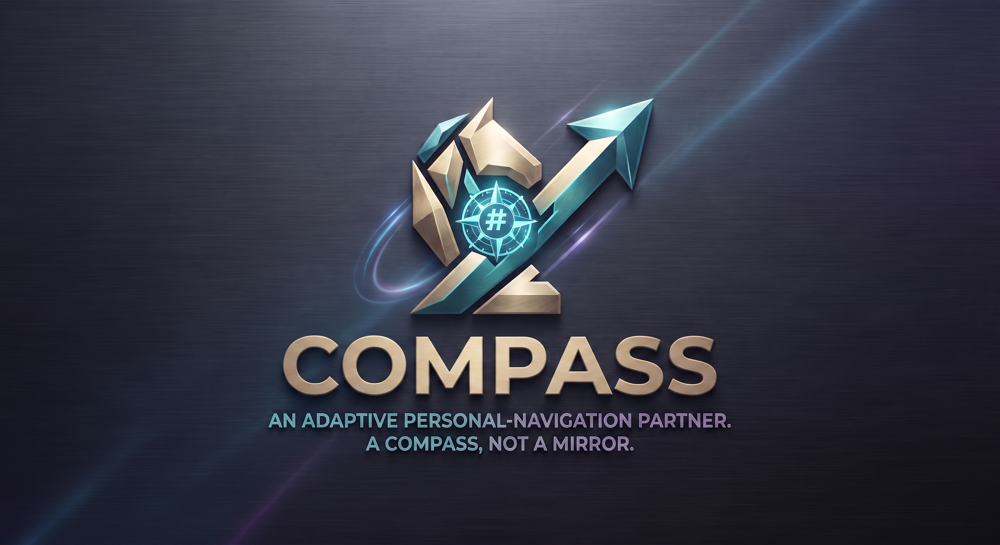
</p>

# COMPASS

**Figure out what to lean into — from evidence of your own life, not a personality quiz.**

Most people don't really know what to dedicate themselves to. The tools that
promise to help just hand you a confident label from a ten-question quiz —
*"you're an ENFP"*, *"spatial reasoning: 68%"* — with nothing real behind it,
and no idea what to actually *do* next. And they flatter you: tell the quiz what
you want to hear and it agrees.

COMPASS is the opposite — a compass, not a mirror. It helps you discover what to
lean into from **evidence of your own life**, one small step at a time. Instead
of a verdict about who you are, it keeps rival explanations about a capability
alive, proposes a concrete experiment that would tell them apart, you run it in
your real life, and a sealed, auditable engine — never an AI — moves the number.

**And it doesn't wait for you to ask.** COMPASS runs an autonomous **Autopilot**
in the background — the *same* agent team, unattended, on a schedule (a Cloud
Run Job triggered by Cloud Scheduler). While you sleep it does the heavy
lifting: it reads your sealed state, names the capability worth testing, drafts
your next discriminating experiment, searches the web (Gemini + Google Search)
for concrete ways to run it, and stands guard over the tamper-evident ledger of
*every* user — then leaves a ready-to-act briefing waiting. You wake up to the
work already done. Crucially, its autonomy is over the **heavy lifting, never
over your decision**: it proposes and it watches; it never validates evidence,
closes an experiment, or moves a single sealed number — a fail-closed guard
raises if a run ever did. That is what "autonomous" should mean for a system
whose output is a claim about *you*.

Two invariants separate it from a personality test with a chatbot bolted on:

1. **No claim about the person exists without recorded, sealed evidence.**
2. **No number describing the person ever comes out of an LLM.** A
   deterministic engine computes and *seals* every index before any model
   is called.

The full design rationale is in [`docs/COMPASS-DESIGN-v0.md`](docs/COMPASS-DESIGN-v0.md).

---

## Start in 60 seconds

You do not need to understand abduction, hashes, or determinism to use COMPASS. You get a **Compass ID** — no email, no password (copy it to return to your compass later) — a built-in **60-second Quick Tour**, and an interface that always shows you **one single next step**. **You can stop anytime — nothing is lost.**

Pick how you want to move:

- **Calm mode** — a guided path, one action at a time (the default; for anyone a dashboard overwhelms).
- **Full dashboard** — everything at once, when you want to explore.
- **Chat with the Companion** — the ADK multi-agent team; just talk to it.

In plain terms, the loop is: you start from **your own story or the intake tests** → COMPASS surfaces **possible signals** about your capabilities → they appear **pending**, and **you** decide which are really you → it keeps **rival hypotheses** alive instead of declaring "you are X" → it proposes a **concrete experiment** to tell them apart → you run it in your life and record what happened → it folds the evidence in and **recomputes** your index → you can weigh it against a **career path**, or just **chat with the team** to keep going. You never do it all at once — it always offers exactly one next action.

The rigor below is a strength, not a hoop to jump through: a first-time user gets going in seconds; the deterministic engine, the hash-chaining and the rival-hypothesis logic run underneath a clean interface.

---

## Everything inside COMPASS

A full vocational-discovery partner, not a demo. Here is exactly what it does.

### Two intake tests — two separate categories, each a validated model

Neither returns a verdict. A high score does not label you: it **seeds a hypothesis to test**, and nothing counts until you validate it and an experiment discriminates it.

- **Big Five — 50 questions.** Broad personality traits (the OCEAN model), public-domain IPIP items, answered on a 1–5 scale.
- **RIASEC — 60 questions.** Vocational interests (Holland's model), 60 **original** items we wrote ourselves — the model is free, and writing our own items keeps us clear of proprietary tests — answered on a 1–5 scale.

### The abductive cycle, step by step

Every step below is sealed and appears in the append-only audit chain:

1. **State two rival hypotheses** about a capability — competing explanations, held alive at once.
2. **Bring in evidence** — self-report, behavioral, outcome, or paste a life narrative and let the **Extractor** turn it into candidate signals (they arrive **pending**).
3. **Validate** the evidence you agree with — only *your* validation makes it real; the model has no authority.
4. **Link** validated evidence to a hypothesis — it only counts once linked.
5. **Recompute & reseal** — the deterministic engine computes the integer **0–1000 index** and seals it (SHA-256, hash-chained).
6. **Design a discriminating experiment** — with its **failure criterion written *before* you run it** — and preregister it.
7. **Run it, record observations, and close it** — the outcome becomes new evidence.
8. **Recompute** to watch the index move, then **Narrate** — Gemini puts the *sealed* state into words. Flip the language toggle and narrate again: the words change, the numbers and the seal do not.

### And there's more

- **Vocational fit.** Name a **trajectory** you are weighing, or **adopt an occupation** from the **O\*NET 31.0 Database** (12 occupations, CC BY 4.0). See it requirement by requirement — **MET / SUPPORTED / OPEN / AGAINST** — what the path *requires* vs. what your evidence *shows*, and find the capability that separates two paths. It is a projection over sealed hypotheses; it moves no index.
- **Chat with a real multi-agent team (Google ADK), live** — a **Companion** orchestrating an **Analyst** (names your open capabilities), an **Activity Scout** (searches the web with Google Search for things to go try), and a **Reflector** (asks the next question). More agents means more proposals, never more authority. → [agent chat](https://compass-agent-1028999311218.us-central1.run.app)
- **An autonomous Autopilot that works while you sleep** — the same team, run **unattended in the background** as a **Cloud Run Job on a Cloud Scheduler cron**. It sweeps every sealed compass, watches the seal (a **Sentinel** that verifies the audit chain across all users), and leaves a ready-to-act **next-step briefing** — proposed experiment, activities to run it, narration — *beside* your base. It never validates, links, closes or seals anything: a fail-closed guard raises if a run ever moved a sealed index. Autonomy over the *heavy lifting*, never over your *decision*. → `compass.agent.autopilot`, `deploy/autopilot/`
- **Your version vs. the record** — a **confrontation** view surfaces where your self-perception and the sealed evidence disagree.
- **A sealed, auditable core** — exact fractions (no floating point in the decision path), SHA-256, an append-only hash-chained ledger with an **independent verifier**: **linkage / integrity / content** each verify on their own. Contradicting evidence weighs *more* than confirming, so it can never flatter you.
- **Calm mode** (one step at a time, for anyone a dashboard overwhelms), **bilingual English / Spanish**, **multi-user with no login**, real **Gemini 3.5 Flash on Vertex AI**, **189 tests**.

---

## Architecture at a glance

<p align="center">
  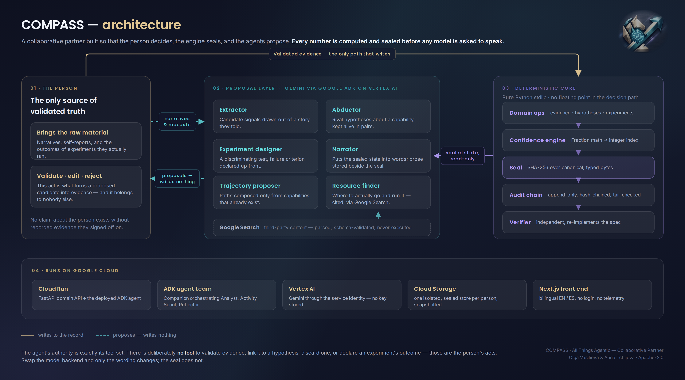
</p>

---

## Hackathon — All Things Agentic

**Category: Collaborative Partner** — an interactive agent that walks the
person through the abductive cycle and learns from the sealed state between
turns.

The three mandatory boxes, all checked:

| Requirement | How COMPASS meets it |
|---|---|
| **Gemini model** (Gemini API or Vertex AI) | `GeminiBackend` (`src/compass/llm.py`) — one backend for both transports via the native `google-genai` env flags. The mandatory model, used only to *narrate* and *propose*. |
| **Google agent framework** | **ADK** — `compass.agent.root_agent` (`src/compass/agent/agent.py`): a **team** of agents — a Companion orchestrator with three specialist `sub_agents` (Analyst, Activity Scout with Google Search, Reflector). More agents means more *proposals*, never more authority: no agent in the team holds a tool that can move a sealed index (enforced by `tests/test_agent_team.py`). |
| **Google Cloud service** | **Cloud Run** hosts the FastAPI backend and the ADK Web UI; **Cloud Run Jobs + Cloud Scheduler** run the autonomous Autopilot sweep in the background; **Vertex AI** serves Gemini through the service identity (no API key stored). See [`DEPLOY.md`](DEPLOY.md). |

- **Live web app (Cloud Run):** https://compass-web-1028999311218.us-central1.run.app
- **Live multi-agent chat (ADK Web UI, Cloud Run):** https://compass-agent-1028999311218.us-central1.run.app — pick `compass_companion` and talk to the team (Companion orchestrating Analyst, Activity Scout, Reflector). Every reply is grounded in the sealed state; no agent can move an index.
- **Demo video:** _to be filled_
- **Architecture diagram:** below, and in [`docs/ARCHITECTURE.md`](docs/ARCHITECTURE.md).

**These are real Gemini calls, not mocks.** `POST /api/narrate` runs
`gemini-3.5-flash` on Vertex AI and returns the *same* state seal it was given —
the model changed the words, not a single sealed number. That is the whole
thesis, and you can verify it against the live backend:

```bash
API=https://compass-1028999311218.us-central1.run.app; U=verify-$RANDOM
H=(-H "X-Compass-User: $U" -H "content-type: application/json")
curl -s "${H[@]}" "$API/api/state"                         | python3 -c "import sys,json;print('state   seal:', json.load(sys.stdin)['seal'])"
curl -s "${H[@]}" -X POST "$API/api/narrate?language=English" | python3 -c "import sys,json;d=json.load(sys.stdin);print('narrate seal:', d['seal']);print(d['prose'][:120])"
# identical seals; the prose is real, request-time Gemini output (not a fixture).
```

### Anyone can use it — judges and owner alike

The hosted service is multi-user with no login. Every browser gets its own
**isolated compass**, keyed by an opaque `X-Compass-User` id (a per-browser
session key, or one you pin to return to yours). Each id maps to its own
sealed SQLite base, seeded with a starter scenario so you land on something
you can immediately explore and modify without touching anyone else's. Each
base is snapshotted to Cloud Storage after every write and restored on
access, so your compass survives cold starts and redeploys. The id is
validated against a strict allowlist (`^[A-Za-z0-9_-]{1,64}$`) before it ever
touches a path. If storage is unreachable the service degrades to local-only
and says so on `/health` — a persistence failure never destroys a computed
result.

### Why this is an *architecturally disciplined* agent

The differentiator is not that an agent talks; it is **where the agent is
not allowed to be**. A language model can read the evidence correctly and
still reach the wrong conclusion under narrative pressure. So the model
never touches the decision path:

- The deterministic engine produces and **seals** every index *before* the
  agent or narrator is invoked. The model cannot influence a value that was
  already fixed.
- The ADK agent's authority is bounded by its tools. Only one tool
  (`recompute_indices`) produces numbers, and it runs the deterministic
  engine and seals the result *before returning it*: the agent reads the
  number, it does not fabricate one. There is deliberately **no tool** to
  validate evidence, discard a hypothesis, or declare an experiment's
  outcome — those are the person's acts.
- **Architecture test:** swapping the model backend (Gemini ↔ the offline
  `demo`/`fake` backend) changes only the wording — never a verdict, seal,
  or the chain of custody. This is enforced by
  `tests/test_hackathon_layer.py::test_swapping_narrator_backend_never_changes_the_seal`.

### What Gemini actually does here

Growing the model's presence means growing what it *proposes*, never what it
decides. Five roles, none with authority:

| Role | Proposes | Person's act |
|---|---|---|
| **Extractor** | candidate signals from a narrative | validating one is what makes it evidence |
| **Abductor** | rival hypotheses about a capability | keeping or discarding one |
| **Trajectory proposer** | candidate paths, composed **only** from hypotheses that already exist | accepting one creates it, through the ordinary endpoints |
| **Experiment designer** | a discriminating experiment for an open capability — design, success criterion, and the **failure criterion declared before running it** | editing it and preregistering it |
| **Resource finder** | concrete places to go *run* that experiment — a course, community, open project, reading, tool, or kind of person — found by Google Search on Vertex, each with its source | deciding whether any is worth their time |

The last three answer the question a vocational test usually dodges: not
"what are you like" but **"what do you do on Monday to find out"** — and the
trajectory proposer answers the one before it, *which paths are even worth
weighing*, so nobody starts at a blank page.

All three are proposals in the strict sense — asking for any of them writes
nothing, appends nothing to the chain, and moves no index. That is not a
convention, it is a test: `test_suggesting_moves_no_sealed_number` and
`test_proposing_trajectories_moves_no_sealed_number` compare the sealed
state, the chain length and a fresh recompute across the calls, and fail if
any of them budges. A negative control confirmed they go red the moment an
endpoint writes.

The trajectory proposer carries a guard of its own: **it may only cite
hypotheses that exist**. A model that could invent a hypothesis id could
invent the capability that makes a path look good, so every requirement is
checked against the person's real ids and an unknown one is rejected at the
boundary rather than created (proposing *new* capabilities is the abductor's
job, not this one's). Accepting a proposal runs the same two endpoints the
person would use by hand — the proposer gets no private write path.

Two honesty rules the resource finder carries, because it is the first
feature that reads the outside world:

- **Web content is data, never instruction.** It is parsed, validated
  against a closed schema (a fixed vocabulary of resource kinds, bounded
  lengths, the same no-percentages guard the narrator has), rendered as
  text and links, and never executed. Non-`http(s)` URLs are stripped at
  the boundary.
- **A search says it searched.** Backends that cannot search return
  `grounded: false` and the UI says so in as many words, with no URLs
  attached. Presenting a model's memory as a search would be exactly the
  unsupported claim this project exists to refuse. Nothing found is
  evidence: resources live outside the seal and never enter the ledger.

Searching sends the capability's wording to Google, so it is always an
explicit click — never something the system does on its own (design doc §6).

---

## Architecture

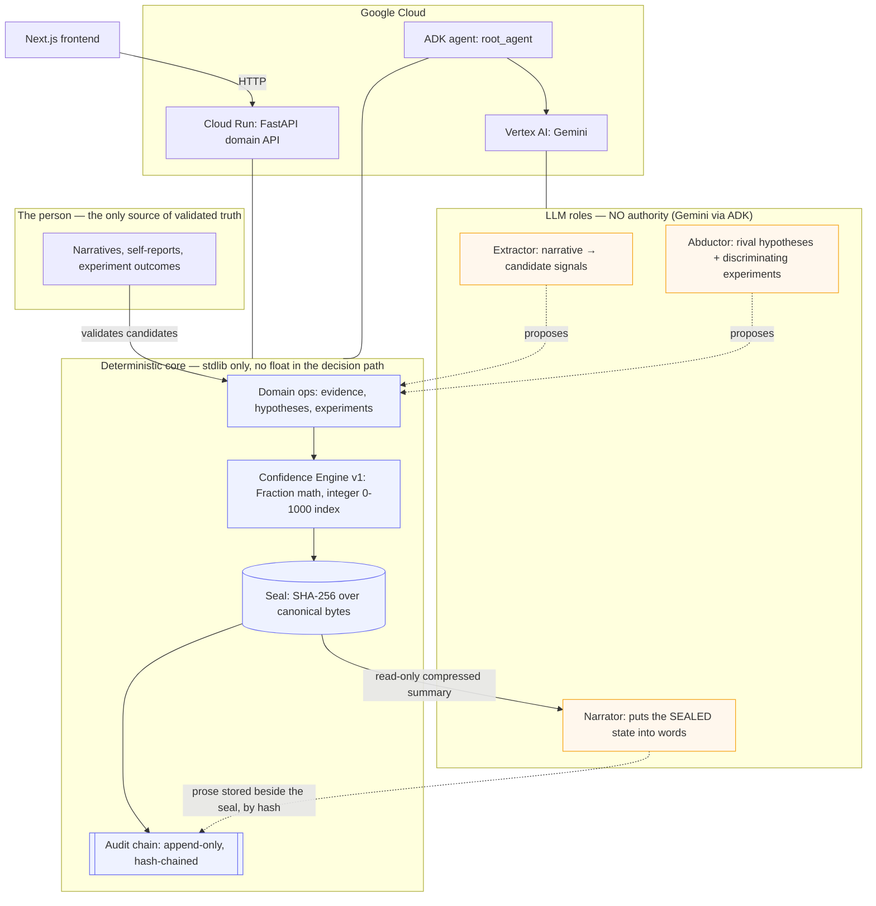

**Authority — who may assert what:**

| Component | Authority | May |
|---|---|---|
| Evidence ledger | the person + the facts | record validated evidence, never delete it silently |
| Confidence engine | versioned rules | compute indices, seal them |
| LLM (Gemini) | none | propose, abduce, narrate — never decide or score |

---

## Quickstart

The core is **pure Python stdlib**. It runs the entire cycle offline, with
no credential and no cloud, using a role-aware `demo` backend.

### 1. The core cycle (CLI, offline)

```bash
python3 -m pytest                          # 162 tests — see "Tests" for the extras
PYTHONPATH=src python3 -m compass init     # then: person, evidence, hyp, link, exp,
                                           # observe, reflect, recompute, compass,
                                           # traj, verify
python3 tools/verify_chain.py compass.db   # independent, stdlib-only verifier
```

`compass verify` reports the three chain signals separately — linkage,
integrity and content — and exits non-zero if any of them breaks. Its own
output strings are still Spanish-only (the API, the narrator and the web app
are bilingual EN/ES).

**Trajectories (vocational fit).** "What to dedicate yourself to" is treated as
a *fit* between demonstrated capabilities and what a path requires — never a
destiny percentage. A trajectory is a set of capability-requirements, each
backed by a hypothesis; `traj fit` projects, deterministically from the sealed
hypotheses, which requirements are met / supported / open / against / discarded
(counts, no probability), and `traj discriminate` names the cheapest open
capability whose experiment would separate two paths. It reuses the same
evidence and experiment machinery; it reads sealed hypotheses and moves no
index. See [`docs/ATTRIBUTIONS.md`](docs/ATTRIBUTIONS.md) for the validated,
openly-licensed instruments (IPIP, O*NET) the intake layer will draw on.

`tools/verify_chain.py` re-implements the seal spec on purpose, so
confirming the audit chain does not require trusting the code that wrote it.

### 2. The API + web app (local)

```bash
pip install '.[api]'                        # fastapi + uvicorn + google-cloud-storage
COMPASS_BACKEND=demo COMPASS_DB=/tmp/compass.db \
  uvicorn compass.api:app --reload --port 8080
# → http://localhost:8080/health  and  /docs
```

The API seeds a demo scenario on first boot, so the compass is populated
immediately. Then, in `frontend/`:

```bash
cd frontend && npm install
NEXT_PUBLIC_API_URL=http://localhost:8080 npm run dev   # → http://localhost:3000
```

The web app covers the evidence → hypothesis → experiment cycle, the audit
chain (linkage, integrity *and* content), the three LLM roles
(`extract` / `abduce` / `narrate`), and the trajectory fit — counts per
requirement, never a destiny percentage. The demo scenario seeds two rival
trajectories over the same sealed hypotheses, so the fit is explorable on the
first visit.

### 3. With the real Gemini model

```bash
pip install '.[gemini,adk]'
# Gemini API key:
export COMPASS_BACKEND=gemini GEMINI_API_KEY=...        COMPASS_MODEL=gemini-2.5-flash
# — or Vertex AI (no key stored):
export COMPASS_BACKEND=gemini GOOGLE_GENAI_USE_VERTEXAI=TRUE \
       GOOGLE_CLOUD_PROJECT=vigia-497422 GOOGLE_CLOUD_LOCATION=global
```

The ADK agent (`compass.agent.root_agent`) is a separate entry point from
the domain API. Run it interactively with the ADK dev UI, or deploy it with
ADK's first-class Cloud Run command:

```bash
adk web src/compass                 # dev UI, discovers the root_agent package
adk deploy cloud_run src/compass/agent   # containerize + deploy the agent
```

### 4. Deploy to Cloud Run

See [`DEPLOY.md`](DEPLOY.md) for the full recipe (project, APIs, env vars,
and the two Gemini-3.x gotchas). Short version:

```bash
gcloud run deploy compass --source . --region us-central1 --allow-unauthenticated \
  --session-affinity --min-instances 1 \
  --set-env-vars COMPASS_BACKEND=gemini,GOOGLE_GENAI_USE_VERTEXAI=TRUE,\
GOOGLE_CLOUD_PROJECT=vigia-497422,GOOGLE_CLOUD_LOCATION=global,\
COMPASS_MODEL=gemini-2.5-flash,COMPASS_GCS_BUCKET=compass-user-data-vigia-497422
```

---

## What the deterministic core guarantees

- **No float in the decision path.** `fractions.Fraction` for every weight,
  ratio, and accumulation; the integer 0–1000 index is an asymptotic floor
  (total certainty never exists — structural fallibilism). The index means
  "accumulation of evidence under versioned rules", and the UI never
  presents it as a probability.
- **Contradicting evidence weighs more than confirming** (×3/2). A system
  that can only raise confidence is a flattering mirror, not a compass.
- **Corroboration requires a discriminating experiment.** No volume of
  self-report corroborates a hypothesis; only `experiment_result` /
  `outcome_external` evidence can.
- **Canonical, typed, versioned serialization**, sealed with SHA-256 over
  the canonical bytes. `bool` is checked before `int` so `1`, `"1"`, `1.0`,
  `True` are distinguishable.
- **Append-only, hash-chained ledger** with a single genesis, a tail check
  before every append, and linkage/integrity reported *separately* (never
  collapsed into one boolean). Deleting content leaves an honest, visible
  tombstone in the chain, never a silent gap.
- **Referenced content is bound to the chain, not to a mutable column.**
  `verify_content` re-hashes live evidence against the `content_hashes` sealed
  *inside* each chain envelope, so editing the text and its `content_hash`
  together is still detected (Red Team Round 1, finding D1). Reported as a
  third, separate signal: `content_ok` on `/api/chain`, `chain_content_ok` on
  `/health`, and `contenido_ok` in `tools/verify_chain.py`.
- **The narrator cannot dress the index as a probability.** `validate_prose`
  fail-closed rejects any percentage in the narration before it is stored.
- **Schema creation is all-or-nothing, even under concurrent openers.** The
  migration chain runs in one transaction whose write lock is taken *before*
  the stored version is read, so several connections opening the same brand-new
  base — exactly what a first page load does, three requests in parallel —
  cannot observe a half-created schema. Locked in by
  `tests/test_db.py::test_schema_bootstrap_is_atomic_under_concurrent_openers`.
- **The confrontation is computed, never narrated** (design doc §5). "Your
  account says X; the record shows Y" is the concept's most powerful moment
  and its most dangerous, so no model touches it: the engine splits linked,
  validated evidence into what the person *asserts* (`self_report`,
  `narrative_extracted`) and what was *observed* (`behavioral`,
  `experiment_result`, `outcome_external`), fires only when both accounts
  point in opposite directions under §5's minimum conditions, and returns
  counts. The sentence comes from a fixed template. A model under narrative
  pressure could turn a discrepancy into a verdict about who someone is,
  which is exactly what §5 forbids. Silence on one side is a gap, not a
  contradiction, and never fires.
- **Determinism is proven, not asserted:** the same input produces the same
  seal bit-for-bit across fresh processes with a different `PYTHONHASHSEED`.

---

## Declared blind spots (the Daubert posture)

A known limitation is an asset. What this project does **not** yet claim:

- **Gemini's live coverage is one model, one transport, exercised by hand.**
  Gemini *has* now run in production (`gemini-2.5-flash` on Vertex, same seal
  as the offline backend), but no automated test makes a real call: the suite
  proves the contract against the offline backends only. Another model,
  region, or SDK version could still surface response-shape differences.
  (Same honesty the skeleton always kept about the Anthropic/Ollama backends.)
- **The grounded search path has never run against Vertex.** `GeminiBackend
  .search` and the citation extraction are written against `google-genai`
  2.x and covered by a stub backend in the suite; no real Google Search call
  has been made from this project yet. The parsing is deliberately
  defensive — missing grounding metadata yields no sources rather than
  invented ones — but the first live call is the one that will confirm the
  response shape.
- **The prompts (extractor/abductor/narrator) are v0, un-audited
  adversarially.** A model captured by a persuasive narrative can propose
  biased *candidates* — the structural mitigation is that nothing enters the
  ledger without the person's validation and no number leaves the model, but
  the quality of proposals is not measured.
- **The prose guard is syntactic, not semantic** (Red Team Round 1, finding A,
  partially fixed). `validate_prose` rejects percentages deterministically; it
  does not catch a smuggled certainty claim in words ("essentially certain").
  A semantic audit of the narration is v2.
- **The engine weights are PROVISIONAL** (`decision_record` #1 records the
  reopening condition: an audit with real data). They unblock the skeleton;
  they are not tuned.
- **Anti-flattery holds over the *linked* graph, not the whole picture**
  (Red Team Round 1, finding C). Contradicting evidence weighs more only where
  it is linked; unlinked disconfirming evidence simply does not count, so an
  incomplete graph can inflate a hypothesis by omission. There is no fully
  deterministic fix; the mitigation is to surface coverage (`/api/state`
  reports `validated_unlinked`) so the gap is visible, not hidden.
- **Persistence is snapshot-based, single-writer.** Per-user SQLite lives on
  local disk and is snapshotted to Cloud Storage after each write (restored on
  access). It is sized for one writer per compass (a person clicking through
  their own cycle) with Cloud Run session affinity; it is not a concurrent
  multi-writer store, and two instances racing on one id is last-writer-wins.
  Honest for the demo, reported on `/health`; a real multi-writer deployment
  would move to a managed database.
- **A writer with total DB access can rewrite history from genesis.** The
  chain makes tampering *detectable* against a verifier holding a prior tail
  hash, not impossible. Anchoring that hash off-machine is an open decision.

The adversarial audit behind several of these — five findings, their
falsification attempts, and what was fixed versus mitigated — is in
[`docs/RED_TEAM_ROUND1.md`](docs/RED_TEAM_ROUND1.md).

---

## Still open

Not blind spots (those are above, and are properties of the design) — this is
work that is simply not done yet.

| # | Open item | Where it bites |
|---|---|---|
| 1 | **Demo video not recorded.** | README and `docs/SUBMISSION.md` both still say *to be filled*. |
| 2 | **The demo scenario cannot exercise `discriminate`.** Both seeded hypotheses are already resolved (one corroborated, one weakened), and only an *unresolved* capability required by exactly one path can discriminate. | The trajectory comparison always lands on its honest empty case, so the cheapest-next-experiment logic is never demonstrated. Seeding a third, still-latent capability would fix it — and would also change the dashboard's "single next step". |
| 3 | **The CLI speaks Spanish only.** The API, narrator and frontend are bilingual EN/ES. | Mixed-language experience for anyone driving the core from a terminal. |
| 4 | **Engine weights still provisional.** `decision_record` #1 names the reopening condition: an audit against real data. | Every index is "accumulation under v1 rules", not a tuned measurement. |
| 5 | **Narration is not semantically audited** (Red Team finding A, partial). | A certainty claim in words can still slip past the percentage guard. |
| 6 | **Tail hash is not anchored off-machine.** | Tampering is detectable only by a verifier that already holds a prior tail. |
| 7 | **The confrontation policy is PROVISIONAL** (`confrontation-v0-provisional`). The step itself now ships; its threshold, frequency and tone are v0 values put there to unblock it, not measured — `decision_record` records the reopening condition. | Every discrepancy shown rests on numbers nobody has justified yet. The panel says so, and the API returns the policy alongside the result, so the rule can be argued with instead of the conclusion. |

---

## Tests

```bash
pip install pytest '.[api,gemini,adk]'
python3 -m pytest -q      # 162 tests, all green
```

**What each extra buys you.** The suite is layered like the code: the core
tests are stdlib-only, the rest need the extra whose surface they cover.

| Installed | Result (162 collected) |
|---|---|
| nothing (stdlib) | 143 pass · 7 fail + 10 error, all `ModuleNotFoundError: fastapi` · 2 skip |
| `.[api]` | 158 pass · 2 fail — the `GeminiBackend` fail-closed tests need `google-genai` · 2 skip |
| `.[api,gemini]` | 165 pass · 2 skip — the ADK tests need `google-adk` |
| `.[api,gemini,adk]` | 162 pass |

Failures in the first two rows are missing dependencies, not regressions; the
core's own tests never need anything but the stdlib.

Red-first: every negative control adulterates the source of truth and
asserts detection. Executed mutations are caught (dropping `prev_hash` from
the hash, collapsing `bool` into `int`, accepting future schemas, counting
unvalidated evidence, removing the anti-flattery factor, late sealing,
priority inversion in the next-step rules). Engine oracles are computed by
hand from the formula; a metamorphic invariant asserts that permuting load
order does not change the index.

## License

Copyright 2026 Olga Vasilieva and Anna Tchijova.

Licensed under [Apache-2.0](LICENSE).


---

## Screenshots

<p align="center">
  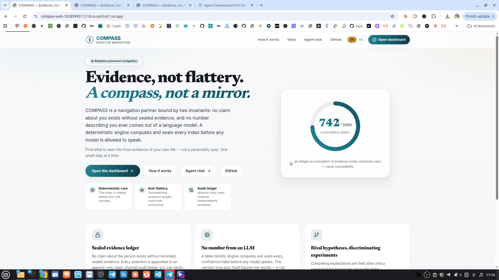
  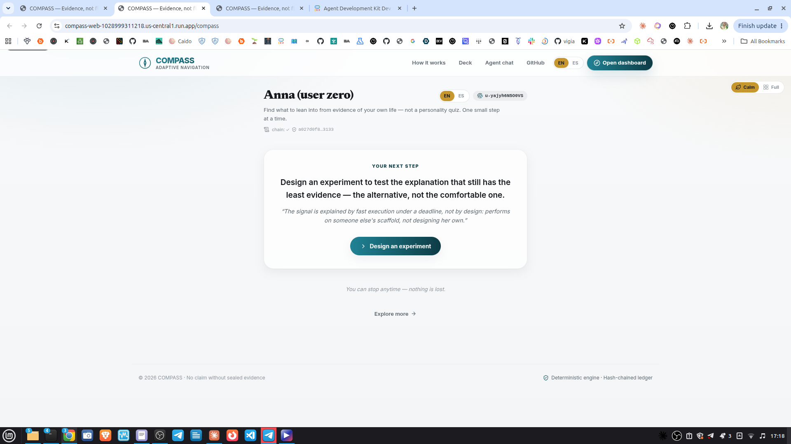
  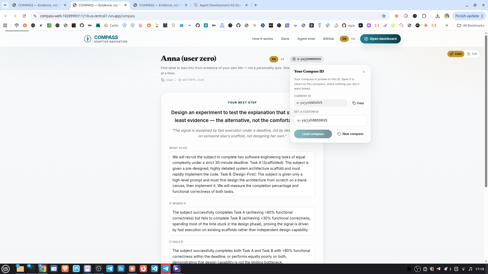
  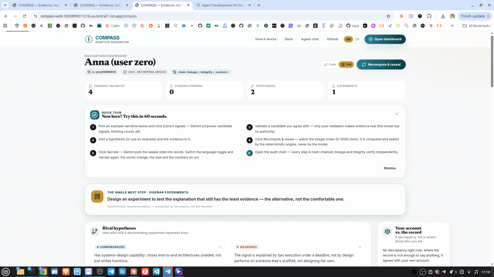
  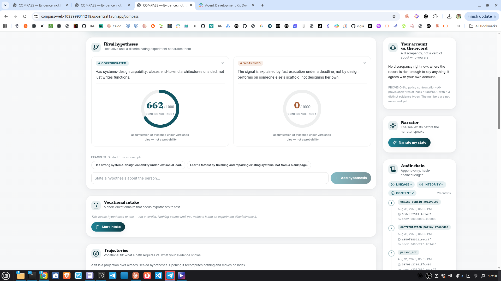
  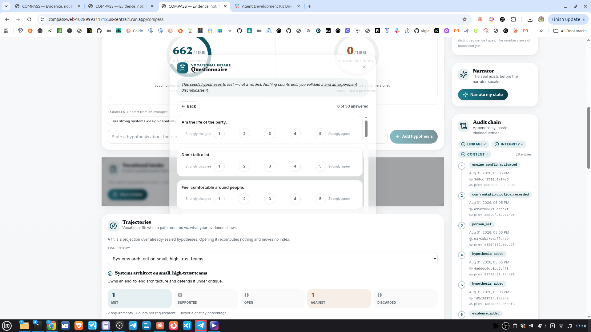
  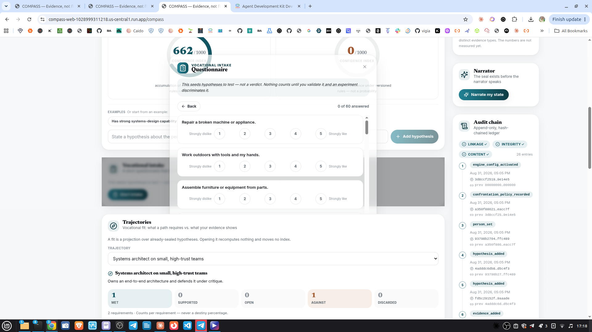
  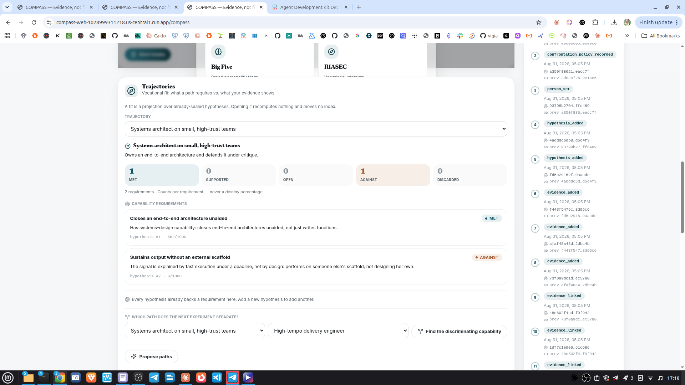
  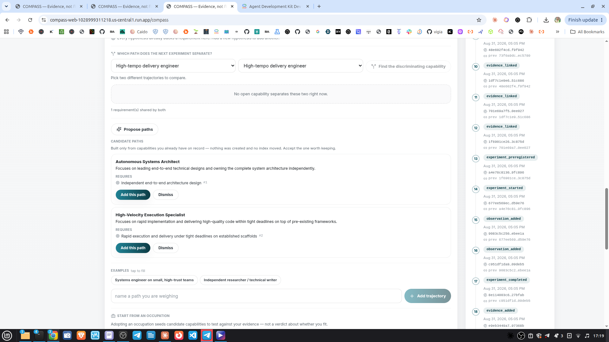
  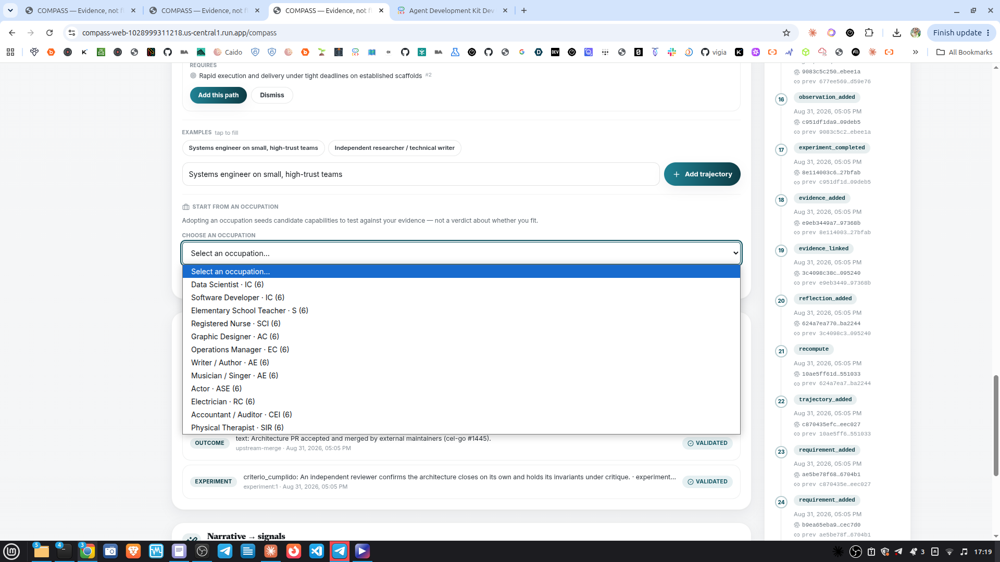
  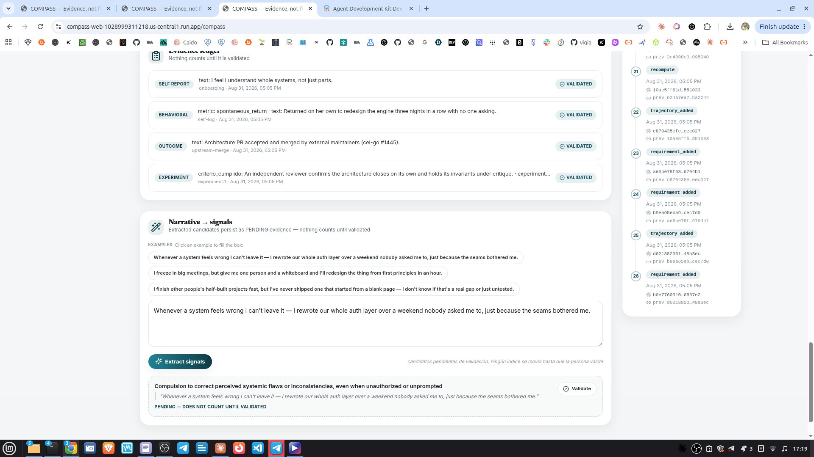
  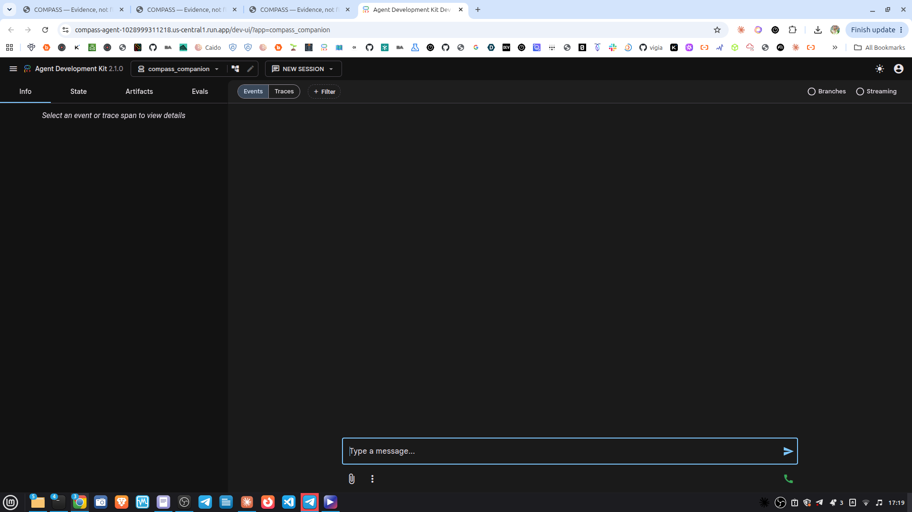
</p>
