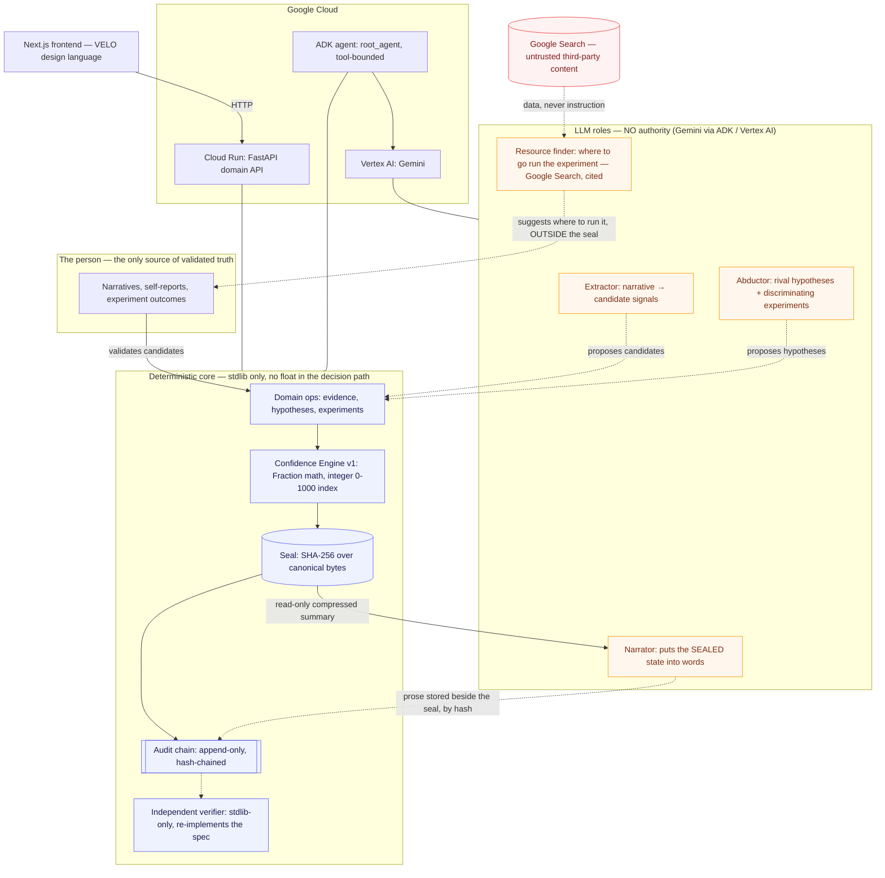
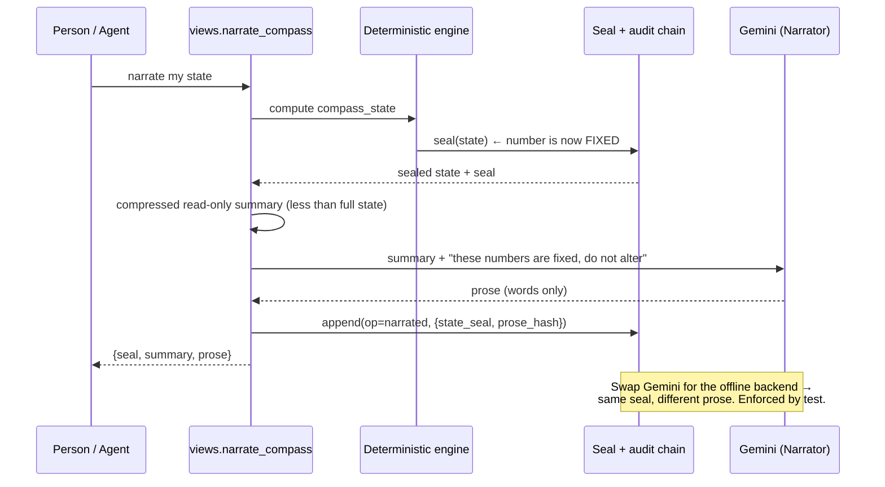

# COMPASS — Architecture

COMPASS is an agentic system built inside-out from a single constraint: **a
language model can read the evidence correctly and still reach the wrong
conclusion under narrative pressure.** Therefore the model never touches the
decision path. Everything below follows from that.

## System components

| Component | File | Authority | Responsibility |
|---|---|---|---|
| Evidence ledger + domain | `src/compass/domain.py`, `db.py` | the person + the facts | record validated evidence; honest tombstones; each op writes its audit entry in the same transaction |
| Confidence engine | `src/compass/engine.py` | versioned rules | `Fraction` math, integer 0–1000 index, deterministic status, seal |
| Audit chain | `src/compass/audit_chain.py` | — | append-only, hash-chained, tail-checked; linkage, integrity and content reported separately |
| Independent verifier | `tools/verify_chain.py` | — | re-implements the seal spec, imports nothing from the package |
| Compass view | `src/compass/views.py` | rules | sealed state + one deterministic next step (ABSTAIN is valid) |
| Trajectories | `src/compass/trajectories.py` | rules | vocational fit: capability-requirements projected over SEALED hypotheses; counts, never a destiny percentage |
| LLM roles | `src/compass/llm.py` | **none** | extractor / abductor / experiment designer / resource finder / narrator; every output validated at the boundary or rejected |
| ADK agent | `src/compass/agent/agent.py` | bounded by its tools | Collaborative Partner over the abductive cycle |
| HTTP API | `src/compass/api.py` | — | thin layer over the sealed domain, for the frontend |

## The crown jewel — seal-first narration

The order is inviolable. The seal exists **before** any model is asked to
speak, and the prose is stored *beside* the seal (by hash), never inside it.

If swapping the narrator backend could change a number, the model would be in
the decision path and the architecture would be broken. The test
`test_swapping_narrator_backend_never_changes_the_seal` fails closed on exactly
that.

## The agent's authority is its tool set

The ADK agent is powerful within a fence it cannot climb. Its tools:

| Tool | Effect | Produces a number? |
|---|---|---|
| `get_compass_state` | read the sealed state | reads only |
| `verify_audit_chain` | linkage / integrity / content, reported separately | no |
| `extract_signals_from_narrative` | persist candidates as **pending** | no |
| `add_hypothesis` | new latent hypothesis | no |
| `preregister_experiment` | experiment with a declared failure criterion | no |
| `recompute_indices` | run the engine, **seal**, return | yes — sealed *before* return |

There is deliberately **no tool** to validate evidence, discard a hypothesis,
or declare an experiment's outcome. Those are the person's acts. The agent
proposes and narrates; the person decides; the engine seals.

**`link_evidence` is absent on purpose.** It was removed in Red Team Round 1
(finding B′): choosing which evidence attaches to which hypothesis *is* a
scoring act — it decides what the engine will count — so it belongs to the
person, not the agent. `test_bprime_agent_has_no_scoring_authority` fails
closed if it ever returns to the tool set.
